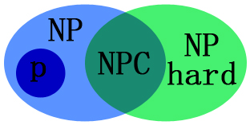

# 21221 算法分析 - 答案与解析

---

## 一、简答

---

### 1. 简述渐近记号的含义。

**▶ 题干：**

简述渐近记号的含义。

**▶ 通俗解释：**

想象你在比较两种洗衣机的洗衣速度。一种洗衣机洗 1 件衣服要 1 分钟，洗 100 件衣服要 100 分钟；另一种洗 1 件衣服要 2 分钟，洗 100 件衣服也是 200 分钟。虽然第二种每件都慢一点，但我们更关心的是：**当衣服多得堆成山的时候**，时间是怎么增长的——是线性增长？还是翻倍增长？

**渐近记号（Asymptotic Notation）** 就是用来描述"当输入规模 n 大到离谱时，算法运行时间的增长趋势"的数学语言。它忽略常数倍数、忽略次要项，只看增长率的主导部分。

打个比方：一场考试你考了 59 分，跟考 60 分的人比好像就差1分，但你挂了、他过了——渐近记号就是在"挂不挂"这个尺度上判断，而不是纠结具体差了几分。

**▶ 答案：**

渐近记号用于描述算法在输入规模 $n \to \infty$ 时的时间/空间复杂度的**增长趋势**（增长率），主要包括五种：

| 记号 | 名称 | 含义 | 通俗类比 |
|------|------|------|----------|
| $O$（大O） | 上界 | 算法的最坏情况，运行时间**不会超过**这个量级 | "你最慢也慢不过骑自行车" |
| $\Omega$（大Omega） | 下界 | 算法的**最好情况**，运行时间**至少需要**这么多 | "你再快也快不过坐飞机" |
| $\Theta$（大Theta） | 紧确界 | 算法的上下界一致，精确描述了增长率 | "你大概需要坐 3 小时高铁" |
| $o$（小o） | 严格上界 | 增长率**严格小于**某函数（不包含等于的情况） | "跑步一定比走路快"（没有"一样快"的可能） |
| $\omega$（小omega） | 严格下界 | 增长率**严格大于**某函数 | "坐飞机一定比走路快" |

**形式化定义**（了解即可）：

- $O(g(n)) = \{f(n) \mid \exists c>0, n_0>0 \text{ 使得 } 0 \le f(n) \le c \cdot g(n), \forall n \ge n_0\}$
- $\Omega(g(n)) = \{f(n) \mid \exists c>0, n_0>0 \text{ 使得 } 0 \le c \cdot g(n) \le f(n), \forall n \ge n_0\}$
- $\Theta(g(n)) = \{f(n) \mid \exists c_1>0, c_2>0, n_0>0 \text{ 使得 } 0 \le c_1 g(n) \le f(n) \le c_2 g(n), \forall n \ge n_0\}$

> 核心记忆：**O 是上限（最坏不差于），Ω 是下限（最好不优于），Θ 是精确描述（就是它）。**

**▶ 举一反三——新例题：**

**【新题】** 某算法的时间复杂度为 $T(n) = 3n^2 + 100n + 500$。请分别给出它的 $O$、$\Omega$、$\Theta$ 表示。

**【答案】**
- $O(n^2)$ —— 因为 $3n^2 + 100n + 500 \le 4n^2$（当 n 足够大时），增长率不会超过 $n^2$ 级别
- $\Omega(n^2)$ —— 因为 $3n^2 + 100n + 500 \ge 3n^2$（当 n 足够大时），增长率至少是 $n^2$ 级别
- $\Theta(n^2)$ —— 上下界都是 $n^2$ 级别，精确地说就是平方级增长

**【简略解析】** 渐近意义下，常数系数（3）、低次项（100n）、常数项（500）统统忽略，只看最高次项 $n^2$ 的增长率。就像 3 斤铁和 5 斤铁，在"用吨来算"的时候都是 0 吨——尺度决定了一切。

---

### 2. 应用 Master 方法解递归方程 $T(n) = 5T(n/5) + n\lg n$。

**▶ 题干：**

应用 Master 方法解递归方程 $T(n) = 5T(n/5) + n \lg n$。

**▶ 通俗解释：**

**Master 定理（主定理）** 是解递归方程的"万能公式"。什么样的递归方程？——像这样"把问题分成 a 份，每份大小是原来的 1/b，然后合并花费 f(n)"的形式：

$$T(n) = aT\left(\frac{n}{b}\right) + f(n)$$

可以理解为：
- $a$ = 分成了多少个子问题（比如归并排序分成 2 份）
- $b$ = 子问题缩小的比例（比如每次对半分，b=2）
- $f(n)$ = 分解 + 合并这些子问题需要的时间

Master 定理的核心思想是：**比较 $f(n)$（合并时间）和 $n^{\log_b a}$（子问题的"权重"），看谁增长得快。**

- 如果合并时间 < 子问题权重 → 复杂度由子问题主导（**Case 1**）
- 如果合并时间 ≈ 子问题权重 × 对数因子 → 两者差不多（**Case 2**，**本题就是这个情况**）
- 如果合并时间 > 子问题权重 → 复杂度由合并主导（**Case 3**）

**▶ 答案：**

对照标准形式 $T(n) = aT(n/b) + f(n)$：

- $a = 5$，$b = 5$
- $f(n) = n \lg n$

**Step 1：计算 $\log_b a$**

$$\log_b a = \log_5 5 = 1$$

所以 $n^{\log_b a} = n^1 = n$。

**Step 2：比较 $f(n)$ 与 $n^{\log_b a}$**

$f(n) = n \lg n$，而 $n^{\log_b a} = n$。

两者相差一个 $\lg n$ 的因子，即 $f(n) = n^{\log_b a} \cdot \lg^1 n$。

🦌： 一句话记忆：

- **二类**：`n` 乘几个对数
- **三类**：至少 `n^{1+ε}`

符合 **Case 2（扩展形式）**：$f(n) = \Theta\left(n^{\log_b a} \cdot \lg^k n\right)$，其中 $k = 1$。

**Step 3：套公式**

Case 2 扩展公式：$T(n) = \Theta\left(n^{\log_b a} \cdot \lg^{k+1} n\right)$

$$T(n) = \Theta\left(n \cdot \lg^{2} n\right)$$

**最终答案：$T(n) = \Theta(n \lg^2 n)$**

---

**Master 定理速查表：**

| 条件 | 结论 |
|------|------|
| Case 1：$f(n) = O(n^{\log_b a - \varepsilon})$，$\varepsilon > 0$ | $T(n) = \Theta(n^{\log_b a})$ |
| Case 2：$f(n) = \Theta(n^{\log_b a})$ | $T(n) = \Theta(n^{\log_b a} \lg n)$ |
| Case 2 扩展：$f(n) = \Theta(n^{\log_b a} \lg^k n)$，$k \ge 0$ | $T(n) = \Theta(n^{\log_b a} \lg^{k+1} n)$ |
| Case 3：$f(n) = \Omega(n^{\log_b a + \varepsilon})$，且 $af(n/b) \le cf(n)$，$c < 1$ | $T(n) = \Theta(f(n))$ |

**▶ 举一反三——新例题：**

**【新题 1】** 用 Master 方法解 $T(n) = 9T(n/3) + n$。

**【答案】** $T(n) = \Theta(n^2)$
- $a=9, b=3, \log_3 9 = 2, n^{\log_b a} = n^2$
- $f(n) = n = O(n^{2 - 1})$（$\varepsilon = 1$），符合 Case 1
- 子问题权重 $n^2$ 远大于合并时间 $n$，由子问题主导

**【新题 2】** 用 Master 方法解 $T(n) = 2T(n/2) + n$。

**【答案】** $T(n) = \Theta(n \lg n)$
- $\log_2 2 = 1, n^{\log_b a} = n$
- $f(n) = n = \Theta(n)$，符合 Case 2（$k=0$）
- 这就是归并排序的复杂度

**【简略解析】** 做题步骤：① 找出 a、b、f(n)；② 算 $\log_b a$；③ 比较 $f(n)$ 和 $n^{\log_b a}$；④ 套对应 Case 的公式。

---

### 3. 什么是类 P、类 NP、NP 难、NP 完全问题？画图说明它们的关系。

**▶ 题干：**

什么是类 P、类 NP、NP 难、NP 完全问题？画图说明它们的关系。

**▶ 通俗解释：**

这几个概念可以用"考试做题"来比喻：

- **P 类问题**：像小学数学口算题——**能在合理时间内（多项式时间）直接算出答案**的问题。比如：排序、查找、最短路径。"P" = Polynomial（多项式的），意思是解题时间可以写成 $n^k$ 这种形式。

- **NP 类问题**：像数独——你**可能很难直接解出来，但如果别人给你一个答案，你能快速验证对不对**。比如：给定一个数独的填法，你可以快速检查每行每列每宫是否 1-9 不重复。"NP" = Nondeterministic Polynomial（非确定性多项式），不是 "Not P"！

- **NP 完全问题（NP-Complete, NPC）**：NP 类中的"**终极 BOSS**"——如果哪天有人能快速解决任意一个 NPC 问题，那就等于一次性解决了**所有** NP 问题。数独、旅行商问题（TSP）、背包问题等都是 NPC 的经典代表。NPC 问题有两个特征：① 它本身是 NP 的（答案容易验证）；② 所有 NP 问题都能"约化"到它（即它是 NP 中最难的）。

- **NP 难问题（NP-Hard）**：比 NPC 还难（或至少一样难）的问题——所有 NP 问题都能约化到它，但它**不一定在 NP 中**（即它的解可能甚至无法在多项式时间内验证）。比如：停机问题（判断一个程序是否会永远运行下去）就是 NP-Hard 但不是 NPC。

**约化/归约**的含义：把问题 A 转化成问题 B。如果 B 能快速解决，那 A 也能快速解决。就像"求两个数的平均数"可以归约为"先求它们的和，再除以 2"——如果你会加法和除法，那平均数你也会。

**▶ 答案：**

**定义：**

| 类别 | 定义 | 通俗说法 |
|------|------|----------|
| **P** | 可在**多项式时间**内被**确定性**图灵机**求解**的问题 | "很快能算出答案" |
| **NP** | 可在**多项式时间**内被**确定性**图灵机**验证**的问题（等价于可在多项式时间内被非确定性图灵机求解） | "给我答案，我能快速检查对不对" |
| **NP 完全 (NPC)** | 同时满足：① 属于 NP；② 所有 NP 问题都可在多项式时间内归约到它 | "NP 中最难的那批问题" |
| **NP 难 (NP-Hard)** | 所有 NP 问题都可在多项式时间内归约到它（不要求自身属于 NP） | "至少和 NP 一样难，可能更难" |

**关系图：**



**关键关系：**
- **P ⊆ NP**（这被认为是显然的：能快速解的问题，肯定也能快速验证）
- **NPC = NP ∩ NP-Hard**（NPC 就是 NP 和 NP-Hard 的交集）
- **P 是否等于 NP？** —— 这是计算机科学最著名的未解难题之一（千禧年七大数学难题，奖金 100 万美元）。绝大多数科学家相信 **P ≠ NP**。

如果 P = NP（可能性极小），则：
- 上图中的 P、NP、NPC 三个圈会合并为一个
- NPC 问题都能在多项式时间内求解 → 数独、密码破解都将变得"容易"
- NP-Hard 中不属于 NP 的部分仍然难

如果 P ≠ NP（公认假设），则存在 **NP 中间问题（NPI）**：属于 NP，但不属于 P 也不属于 NPC 的问题。

**▶ 举一反三——新例题：**

**【新题】** 判断以下说法的正误：
1. P 类问题一定比 NP 类问题容易解决。
2. 所有 NP 完全问题都属于 NP 难问题。
3. 如果一个 NP 难问题被证明可以在多项式时间内求解，则 P = NP。

**【答案】**
1. **错误。** P 类问题**包含于** NP 类，但说"一定比"不准确。我们只知道 P ⊆ NP，但不知道是否 P = NP。如果 P = NP，那它们"一样容易"。

2. **正确。** NP 完全 = NP ∩ NP-Hard，所以所有 NPC 问题都属于 NP-Hard。

3. **错误。** 只有证明了某个 **NP 完全**问题可以在多项式时间内求解，才能推出 P = NP。NP 难问题不一定在 NP 中（比如停机问题），解决了它不一定解决 NP 中的所有问题。

**【简略解析】** 关键记忆点：NPC 是 NP 和 NP-Hard 的交集；"所有 NP 问题都能归约到它"是 NP-Hard 的定义，加上"自身属于 NP"就是 NPC。

---

## 二、算法分析

---

### 1. 分析下列算法的最好、最坏和平均情形的时间复杂度

**▶ 题干：**

```c
for(int i = n - 1; i >= 0 && x < a[i]; i--)
    a[i + 1] = a[i];

a[i + 1] = x;
```

**▶ 通俗解释：**

这段代码在干什么？——假设数组 `a[0..n-1]` **已经从小到大排好序了**，现在要把一个新的元素 `x` **插入**到正确的位置，保持数组仍然有序。

具体做法是：从数组的**最右边**开始往左扫，只要当前位置的元素比 `x` 大，就把它**往右挪一格**（给 `x` 腾位置）。当遇到一个比 `x` 小的元素（或扫到数组最左端），就把 `x` 放在这个位置后面。

这就是**插入排序（Insertion Sort）**中"插入"这一步的核心操作（也可以说是把 x 插入到一个有序数组）。

> 打个比方：你手里拿着一张新牌（x），要插入手中已经排好序的一把牌中。你从右往左扫，遇到比自己大的牌就把它往右移一格，遇到比自己小的牌就停住，把手里的牌放进去。

**▶ 答案：**

设基本操作为**比较**（`x < a[i]`）的次数。

**最好情形：** $O(1)$
- **条件**：$x \ge a[n-1]$（x 比数组最后一个元素（最大的）还大或相等）
- **过程**：循环条件 `x < a[n-1]` 一开始就不成立，循环体一次也不执行
- **比较次数**：1 次
- **复杂度**：$\Theta(1)$

**最坏情形：** $O(n)$
- **条件**：$x < a[0]$（x 比数组中所有元素都小）
- **过程**：循环从 $i = n-1$ 一直执行到 $i = 0$，共 $n$ 次；然后再判断 $i = -1$ 时条件 $\text{false}$（因为 `i >= 0` 不满足了），循环退出
- **比较次数**：$n + 1$ 次
- **复杂度**：$\Theta(n)$

**平均情形：** $O(n)$
- **条件**：x 随机地均匀分布在数组中
- **过程**：x 平均应该插入在中间位置附近，大约需要移动 $n/2$ 个元素
- **比较次数**：约 $(n+1)/2$ 次
- **复杂度**：$\Theta(n)$

> **总结**：最好 $\Theta(1)$，最坏 $\Theta(n)$，平均 $\Theta(n)$。

**▶ 举一反三——新例题：**

**【新题】** 分析以下算法的最好、最坏和平均时间复杂度：

```c
// 在有序数组 a[0..n-1] 中查找 x 的位置
int left = 0, right = n - 1;
while (left <= right) {
    int mid = (left + right) / 2;
    if (a[mid] == x) return mid;
    else if (a[mid] < x) left = mid + 1;
    else right = mid - 1;
}
return -1;
```

**【答案】**
- **最好情形：** $\Theta(1)$ —— x 恰好在数组中间位置，第一次 `mid` 就命中
- **最坏情形：** $\Theta(\lg n)$ —— x 不在数组中（或在最边上），每次对半砍搜索范围，共砍约 $\lg n$ 次
- **平均情形：** $\Theta(\lg n)$ —— 和最好、最坏的差距不大，因为每次都是对半砍

**【简略解析】** 这题是经典的**二分查找**。注意它和上一题的区别：上一题是顺序查找（一个个扫），这题是二分查找（每次砍一半）。二分查找比顺序查找快得多（$\lg n$ vs $n$），但前提是数组**必须有序**。

---

### 2. 分析求解 Hanoi 问题的算法的渐近复杂度

**▶ 题干：**

```c
void Hanoi(A, C, n){
    if n = 1
        move(A, C);
    else{
        Hanoi(A, B, n - 1);
        move(A, C);
        Hanoi(B, C, n - 1);
    }
}
```

**▶ 通俗解释：**

**汉诺塔（Hanoi Tower）**是一个经典递归问题：

> 有三根柱子 A、B、C。A 柱上有 n 个大小不同的圆盘，从下到上由大到小叠放。要把所有盘子移到 C 柱，移动时必须遵守：① 一次只移一个盘子；② 大盘子不能压在小盘子上。B 柱可以作为中转站。

递归策略（非常巧妙）：
1. 把上面 n-1 个盘子从 A **借助 C** 移到 B（`Hanoi(A, B, n-1)`）
2. 把最底下的大盘子从 A **直接**移到 C（`move(A, C)`）
3. 把那 n-1 个盘子从 B **借助 A** 移到 C（`Hanoi(B, C, n-1)`）

> 注意代码中 B 没有出现在参数列表中（应该是 `Hanoi(A, B, C, n)`），B 是 A 和 C 之外的那根柱子。

**▶ 答案：**

**Step 1：写出递归方程**

设移动 n 个盘子所需的基本操作次数为 $T(n)$：

- 当 $n = 1$：只需 1 次移动，$T(1) = 1$
- 当 $n > 1$：
  - 移上面 $n-1$ 个盘子：$T(n-1)$
  - 移最底下盘子：1
  - 再把 $n-1$ 个移回来：$T(n-1)$
  - $$T(n) = 2T(n-1) + 1$$

**Step 2：求解递归方程**

展开：

$$\begin{aligned}
T(n) &= 2T(n-1) + 1 \\
     &= 2[2T(n-2) + 1] + 1 = 4T(n-2) + 2 + 1 \\
     &= 4[2T(n-3) + 1] + 2 + 1 = 8T(n-3) + 4 + 2 + 1 \\
     &= \cdots \\
     &= 2^{n-1}T(1) + (2^{n-2} + 2^{n-3} + \cdots + 2^0) \\
     &= 2^{n-1} + (2^{n-1} - 1) \\
     &= 2^n - 1
\end{aligned}$$

**最终答案：$T(n) = 2^n - 1$，渐近复杂度为 $\Theta(2^n)$（指数级复杂度）。**

> **直观感受**：n=3 时需要 7 步；n=10 时需要 1023 步；n=64（传说中的末日故事）需要约 $1.8 \times 10^{19}$ 步，每秒移一次需要约 5800 亿年——比宇宙年龄还长！

**▶ 举一反三——新例题：**

**【新题】** 写出以下递归方程的解，并给出渐近复杂度：

$$T(n) = \begin{cases} 1 & n = 1 \\ 3T(n-1) + 2 & n > 1 \end{cases}$$

**【答案】** $T(n) = 2 \cdot 3^{n-1} - 1$，渐近复杂度 $\Theta(3^n)$。

**【简略解析】** 展开：$T(n) = 3T(n-1) + 2 = 9T(n-2) + 6 + 2 = 27T(n-3) + 18 + 6 + 2 = \cdots = 3^{n-1} \cdot 1 + 2(3^{n-2} + \cdots + 1) = 3^{n-1} + 2 \cdot \frac{3^{n-1}-1}{2} = 2\cdot 3^{n-1} - 1$。

---

## 三、贪心法

---

### 1. 写出最小化 ACT 算法的伪代码，并分析其复杂性

**▶ 题干：**

已知 n 个任务的执行序列。假设任务 i 需要 $t_i$ 个时间单位。如果任务完成的顺序为 $1, 2, \ldots, n$，则任务 i 的**完成时间**为：

$$c_i = \sum_{j=1}^{i} t_j$$

任务的**平均完成时间（ACT）**为：

$$ACT = \frac{1}{n}\sum_{i=1}^{n} c_i$$

生成一个任务序列使得 ACT 最小。生成的方法是：分 n 步生成一个任务序列，每一步从剩下的任务里选择时间最少的任务。

**▶ 通俗解释：**

假设你是银行柜员，面前排了一队顾客，每个顾客的业务处理时间不同。你要决定先服务谁、后服务谁，使得**所有顾客的平均等待时间最短**。

直觉上应该怎么做？——**让快的先办！** 这样后面的人不用等太久。

- 如果先办一个 1 小时的大业务，后面 10 个人都得等 1 小时；
- 如果先办 10 个各要 1 分钟的快业务，那个 1 小时的大客户也只多等了 10 分钟。

这个"**每次挑耗时最短的任务先做**"的策略就是本题的贪心算法，也叫 **SPT（Shortest Processing Time first，最短处理时间优先）** 规则。

为什么叫"贪心法（Greedy）"？——因为它在每一步都做出**当前看起来最好**的选择（选最短的任务），而不考虑全局后果。但数学上可以证明，这个"贪心"的选择恰好能得到全局最优解。

> **ACT 公式的含义**：$c_i$ 是第 i 个任务的完成时间 = 前 i 个任务时间之和（包括它自己）。ACT 就是所有任务完成时间的平均值。我们想让这个平均值尽可能小。

**▶ 答案：**

**伪代码：**

```
算法：MinACT(t[1..n])
输入：n 个任务的执行时间数组 t[1..n]
输出：使 ACT 最小的任务执行序列

步骤：
1. 将 t[1..n] 按非递减顺序排序（从小到大）     // 选择排序或归并排序均可
2. 排序后的序列即为最优执行序列
3. 可计算 ACT：
   total_completion = 0
   current_sum = 0
   for i = 1 to n do
       current_sum = current_sum + t[i]      // c_i
       total_completion = total_completion + current_sum
   ACT = total_completion / n
   return 排序序列, ACT
```

**复杂度分析：**
- 排序：$O(n \log n)$（使用归并排序/堆排序等比较排序）
- 计算 ACT：$O(n)$
- **总复杂度：$O(n \log n)$**

> 使用计数排序等非比较排序可达 $O(n)$（当任务时间范围有限时），但这里以比较排序为准。

**▶ 举一反三——新例题：**

**【新题】** 有以下 4 个任务，时间分别为 $t = (8, 3, 1, 5)$。求：
1. 按原顺序 $(1,2,3,4)$ 执行的 ACT
2. 使用贪心算法 SPT 排序后执行的 ACT

**【答案】**
1. 原顺序：$c_1=8$，$c_2=8+3=11$，$c_3=11+1=12$，$c_4=12+5=17$，ACT = $(8+11+12+17)/4 = 12$
2. SPT 排序：$t = (1, 3, 5, 8)$，$c_1=1$，$c_2=4$，$c_3=9$，$c_4=17$，ACT = $(1+4+9+17)/4 = 7.75$

SPT 将 ACT 从 12 降到了 7.75，效果显著！

**【简略解析】** 贪心的核心：**短任务优先**。排序后短任务在前面，减少了长任务等待时的惩罚（长任务本身对 ACT 的贡献被"推迟"到了后面）。

---

### 2. 证明利用该算法生成的任务序列具有最小的 ACT

🦌：懒人继续跳过证明题

**▶ 题干：**

证明利用该算法（SPT，每次选时间最少的任务）生成的任务序列具有最小的 ACT。

**▶ 通俗解释：**

怎么证明"最短的任务先做"一定是最好的？

思路是**反证法（交换论证法）**：假设存在一个最优序列**不是**按时间从小到大排的，那它里面必然存在相邻的两个任务，前面的比后面的时间长。我们就把这两个任务**交换位置**，证明交换后 ACT 不仅不变大，反而**变小**了。这就矛盾了（"最优"竟然不是最好）——从而证明最优序列一定就是从小到大排的。

这就像证明"从矮到高排队能让队伍总分最均匀"：如果有高的站前面、矮的站后面，交换他们，后面所有人的感受都会变好一点。

**▶ 答案：**

**证明（交换论证法 / Exchange Argument）：**

设 $\pi$ 为任意一个使 ACT 最小的最优任务序列。我们要证明 $\pi$ 中任务一定按处理时间 $t_i$ **非递减**排列（即 $t_{\pi_1} \le t_{\pi_2} \le \cdots \le t_{\pi_n}$）。

**反证法**：假设 $\pi$ 不是按 $t_i$ 非递减排列的，则存在相邻的两个任务 $j$ 和 $k$，满足：
- 任务 $j$ 在任务 $k$ 之前执行
- $t_j > t_k$（前面任务的执行时间大于后面任务）

现在构造一个新序列 $\pi'$：将 $j$ 和 $k$ **交换位置**，其余任务保持不变。

**分析 ACT 的变化：**

设 $j$ 和 $k$ 在序列中处于位置 $p$ 和 $p+1$。记它们之前所有任务的总执行时间为 $S$（即前 $p-1$ 个任务时间之和）。

在原序列 $\pi$ 中：
- 任务 $j$ 的完成时间：$S + \textcolor{red}{t_j}$
- 任务 $k$ 的完成时间：$S + \textcolor{red}{t_j} + \textcolor{blue}{t_k}$

在新序列 $\pi'$ 中：
- 任务 $k$ 的完成时间：$S + \textcolor{blue}{t_k}$
- 任务 $j$ 的完成时间：$S + \textcolor{blue}{t_k} + \textcolor{red}{t_j}$

**令人惊讶的发现**：两个任务完成时间的**总和**不变！都是 $2S + t_j + t_k$。但注意——

在原序列中，任务 $j$（大任务）完成得早，任务 $k$（小任务）完成得晚。
在新序列中，任务 $k$（小任务）完成得早，任务 $j$（大任务）完成得晚。

对整个 ACT 的影响在于：位置 $p+2$ 及之后的所有任务，在 $\pi'$ 中它们的开始时间**提前了** $t_j - t_k > 0$ 个单位（因为 $j$ 和 $k$ 的总时间不变，但 $\pi'$ 在位置 $p$ 处的完成时间更早）。

- 对于位置 $p$ 之前的任务：完成时间不变
- 对于任务 $j$ 和 $k$：它们的平均完成时间在 $\pi'$ 中更小（因为小任务先完成，降低了小任务的等待时间）
- 对于位置 $p+1$ 之后的所有任务：每个任务的完成时间都**减少了** $t_j - t_k > 0$

因此 $ACT(\pi') < ACT(\pi)$，与"$\pi$ 是最优序列"矛盾！

> 严谨版本：对两个任务位置 i 和 i+1 的完成时间之和计算：
> 原：$c_i + c_{i+1} = (S+t_j) + (S+t_j+t_k) = 2S + 2t_j + t_k$
> 新：$c_i' + c_{i+1}' = (S+t_k) + (S+t_k+t_j) = 2S + t_j + 2t_k$
> 差：$(2S + 2t_j + t_k) - (2S + t_j + 2t_k) = t_j - t_k > 0$
> 新序列的 $c_i + c_{i+1}$ 更小，其他 c 不变或更小，故 ACT 严格下降。

因此，任何最优序列中都不应存在"大任务排在小任务前面"的相邻逆序对，即最优序列必然是 $t_i$ 的非递减排列。证毕。∎

**▶ 举一反三——新例题：**

**【新题】** 使用交换论证法证明：在**带权重的任务调度**中（每个任务有权重 $w_i$），最小化 $\sum w_i \cdot c_i$（加权完成时间之和）的最优策略是按 $\frac{t_i}{w_i}$（时间除以权重）升序排列。请给出证明的大致思路。

**【答案思路】** 同样假设存在相邻任务 $j$ 在 $k$ 前但不满足 $\frac{t_j}{w_j} \le \frac{t_k}{w_k}$，交换它们。计算加权完成时间和的变化，发现交换后总值减小（因为 $\frac{t_j}{w_j} > \frac{t_k}{w_k}$ 时 $w_k t_j > w_j t_k$），产生矛盾。

**【简略解析】** 这是"Smith 规则"——交换论证法是证明贪心算法正确性的最常用方法，核心套路是"假设最优解中有逆序 → 交换 → 证明不降反升 → 矛盾"。

---

## 四、分治法

---

### 快速排序（每次选 A[3] 为支点）

**▶ 题干：**

对数组 $A[1:n]$ 进行排序。使用快速排序的方法，每次选择 $A[3]$ 作为支点元素。写出该排序算法的伪代码，并分析其最好和最坏情形下的时间复杂度。

**▶ 通俗解释：**

**快速排序（QuickSort）** 是分治法的经典代表。核心思想：

1. **选支点（pivot）**：在数组中选一个元素作为"标杆"
2. **分区（partition）**：把比支点小的放左边，比支点大的放右边
3. **递归**：对左右两边分别重复上述过程

> 打个比方：体育课排队，老师选了第三个人作为"身高标杆"，然后叫"比他矮的站左边，比他高的站右边"，然后对左边那拨人和右边那拨人分别再选标杆、再分……直到每个人都站好了。

本题的特殊之处：**每次都选 A[3]（即当前子数组的第 3 个元素）作为支点**，而不是常见的随机选或选中位数。

**▶ 答案：**

**伪代码：**

```
算法：QuickSort3(A, low, high)
输入：数组 A，排序范围 [low, high]
输出：A[low..high] 按非递减顺序排序

if low < high then
    pivot_pos ← Partition(A, low, high)
    QuickSort3(A, low, pivot_pos - 1)
    QuickSort3(A, pivot_pos + 1, high)

算法：Partition(A, low, high)
// 选取 A[low+2]（即第3个元素）作为支点
pivot_idx ← low + 2
if pivot_idx > high then
    pivot_idx ← high                  // 子数组不足3个元素时，取最后一个
pivot_val ← A[pivot_idx]
交换 A[pivot_idx] 和 A[high]         // 将支点移到末尾

i ← low - 1
for j ← low to high - 1 do
    if A[j] ≤ pivot_val then
        i ← i + 1
        交换 A[i] 和 A[j]
交换 A[i+1] 和 A[high]               // 支点归位
return i + 1
```

**最好情形时间复杂度：$O(n \log n)$**

- **条件**：每次 A[3]（即子数组第 3 个元素）恰好是中位数附近，左右两部分大小差不多
- **递归方程**：$T(n) = 2T(n/2) + O(n)$
- **解**：$T(n) = \Theta(n \log n)$
- 例如：数组为 $\{1, 100, \textbf{50}, 2, 101, \ldots\}$，A[3] 恰是中位数

**最坏情形时间复杂度：$O(n^2)$**

- **条件**：每次 A[3] 恰是子数组中的最小值或最大值，导致一边几乎为空
- **递归方程**（以升序排列为例）：
  - 若数组已从小到大排好：A[3] 是第 3 小的元素
  - 分区后，左边约 2 个元素，右边约 n-3 个元素
  - $T(n) = T(2) + T(n-3) + O(n) = T(n-3) + O(n)$
  - 展开：$T(n) = T(n-3) + O(n) = T(n-6) + O(n) + O(n-3) = \cdots = O(n^2)$
- **解**：$\Theta(n^2)$
- 极端情况：**完全有序的数组**就是最坏情形之一！这也是为什么实际中快速排序要"随机选支点"的原因。

> **核心结论**：固定选 A[3] 作为支点是不可靠的——最坏情况 $O(n^2)$，最好情况 $O(n \log n)$。而标准的随机化快速排序可以保证**期望**时间复杂度为 $O(n \log n)$。

**▶ 举一反三——新例题：**

**【新题】** 使用快速排序对数组 $[29, 10, 14, 37, 13, 20]$ 进行排序，**每次选第一个元素作为支点**。画出第一轮 Partition 的过程，并写出 Partition 结束后数组的状态。

**【答案】**
- 支点 pivot = 29（第一个元素）
- 移动支点到末尾：$[20, 10, 14, 37, 13, 29]$
- 扫描 j=0 到 4：
  - j=0: A[0]=20 ≤ 29，i=0，交换 A[0]↔A[0]（不动）→ $[20, 10, 14, 37, 13, 29]$
  - j=1: A[1]=10 ≤ 29，i=1，交换 A[1]↔A[1]（不动）→ 不变
  - j=2: A[2]=14 ≤ 29，i=2，不动 → 不变
  - j=3: A[3]=37 > 29，跳过
  - j=4: A[4]=13 ≤ 29，i=3，交换 A[3]↔A[4] → $[20, 10, 14, 13, 37, 29]$
- 最后交换 A[i+1]=A[4] 和 A[5] → $[20, 10, 14, 13, \textbf{29}, 37]$
- 支点 29 在位置 4，左边都比 29 小，右边都比 29 大 ✓

**【简略解析】** Partition 的核心是维护两个区域：左边的"小值区"和右边的"大值区"。i 始终指向小值区的最后一个位置。

---

## 五、动态规划法

---

### 1. 写出 0/1 背包问题中 $g(i, x)$ 与 $g(i-1, x)$ 的递归关系

**▶ 题干：**

设 $g(i, x)$ 为剩余物品为 $1, 2, \ldots, i$，剩余背包容量 $c = x$ 的 0/1 背包问题的最大效益值。写出 $g(i, x)$ 与 $g(i-1, x)$ 的递归关系。

**▶ 通俗解释：**

**0/1 背包问题**：你有一个容量为 $c$ 的背包，面前有 $n$ 个物品。每个物品有**重量 $w_i$**（占多少空间）和**价值 $p_i$**（值多少钱）。每个物品要么**整个拿走**（1），要么**完全不拿**（0）——不能切一半。问：怎么选能使背包装入物品的总价值最大？

**动态规划** 的核心是"把大问题拆成小问题"。这里 $g(i, x)$ 表示：

> 只考虑前 i 个物品，背包还能装 x 个单位重量，**在这种情况下能获得的最大总价值**。

现在看第 i 个物品：我们只有两种选择——

1. **不拿第 i 个物品**：那最大价值就等于"用前 i-1 个物品、容量仍为 x"时的价值，即 $g(i-1, x)$
2. **拿第 i 个物品**（前提是背包装得下，即 $x \ge w_i$）：背包容量减少 $w_i$，获得价值 $p_i$，总价值 = $g(i-1, x - w_i) + p_i$

我们选两者中**较大的那个**。

> 就像在超市结账时纠结"这个零食要不要买"：不买→剩余的钱不变，总满足感 = 之前选的满足感；买→钱变少、空间变小，但满足感加上这份零食的快乐。选哪个更开心就选哪个。

**▶ 答案：**

**递归关系：**

$$g(i, x) = \begin{cases}
\max\{\, g(i-1, x),\; g(i-1, x - w_i) + p_i \,\} & \text{当 } x \ge w_i \text{（背包能装下第 i 个物品）} \\[8pt]
g(i-1, x) & \text{当 } x < w_i \text{（装不下，只能不拿）}
\end{cases}$$

**边界条件：**

- $g(0, x) = 0$（对于任意 $x \ge 0$）—— 没有物品时，价值为 0
- $g(i, 0) = 0$（对于任意 $i \ge 0$）—— 背包容量为 0 时，什么也装不了

**最终答案**：问题所求即为 $g(n, c)$。

**▶ 举一反三——新例题：**

**【新题】** 有 3 个物品，背包容量 c=10。物品信息：$w=(4,5,6)$，$p=(3,4,5)$。请写出 $g(3,10)$ 的递归计算过程（画一个 DP 表格）。

**【答案】**

| | x=0 | 1 | 2 | 3 | 4 | 5 | 6 | 7 | 8 | 9 | 10 |
|------|-----|---|---|---|---|---|---|---|---|---|----|----|
| i=0 | 0 | 0 | 0 | 0 | 0 | 0 | 0 | 0 | 0 | 0 | 0 |
| i=1 | 0 | 0 | 0 | 0 | 3 | 3 | 3 | 3 | 3 | 3 | 3 |
| i=2 | 0 | 0 | 0 | 0 | 3 | 4 | 4 | 4 | 4 | 7 | 7 |
| i=3 | 0 | 0 | 0 | 0 | 3 | 4 | 5 | 5 | 5 | 7 | **8** |

$g(3, 10) = 8$（选物品 1 和物品 3：重量 4+6=10 ≤ 10，价值 3+5=8）

**【简略解析】** 填表口诀：对每个格子 $g(i,x)$，先看上面一格（不拿），再往左上找 $g(i-1, x-w_i)$ 加上 $p_i$（拿），取较大值。这就是动态规划的"填表法"。

---

### 2. 用元组法计算 $g(4, 20)$ 并回溯得到最优解

**▶ 题干：**

有以下 0/1 背包问题：$n = 4$，$c = 20$，$p = (2, 5, 8, 1)$，$w = (10, 15, 6, 9)$。用元组法计算 $g(4, 20)$，并回溯得到最优解。

**▶ 通俗解释：**

**元组法（又称支配规则法 / 序偶法）** 是解决 0/1 背包问题的另一种 DP 方法。

核心思想：维护一个集合 $S^i$，里面放的是"考虑了前 i 个物品后，所有可能达到的（重量, 价值）组合"。但不可能存下所有组合（太多！），关键技巧是**支配规则**：

> 如果组合 A 的重量比组合 B 重，但价值反而比组合 B 低（或一样），那 A 永远不如 B——A 被 B **支配**了，可以扔掉。

就像买手机：如果手机 A 比手机 B 贵，配置却一样甚至更差，那 A 就不值得考虑——被"支配"了。

**▶ 答案：**

物品信息表：

| 物品 i | 1 | 2 | 3 | 4 |
|--------|---|---|---|---|
| $p_i$（价值）| 2 | 5 | 8 | 1 |
| $w_i$（重量）| 10 | 15 | 6 | 9 |

**Step 1：初始化**

$$S^0 = \{(0, 0)\}$$

（不选任何物品，重量 0，价值 0）

---

**Step 2：考虑物品 1（$w_1=10, p_1=2$）**

将 $S^0$ 中的每个元组加上物品 1：$(0+10, 0+2) = (10, 2)$

$$S^1 = S^0 \cup \{(10, 2)\} = \{(0, 0), (10, 2)\}$$

两个元组互不支配（一个重量小价值小，另一个重量大价值大），都保留。

---

**Step 3：考虑物品 2（$w_2=15, p_2=5$）**

将 $S^1$ 中每个元组加上物品 2：
- $(0+15, 0+5) = (15, 5)$
- $(10+15, 2+5) = (25, 7)$

$$S^2 = \{(0,0), (10,2)\} \cup \{(15,5), (25,7)\} = \{(0,0), (10,2), (15,5), (25,7)\}$$

按重量排序检查支配：
- $(0,0)$：保留
- $(10,2)$：重量 > (0,0)，价值 > (0,0)，互不支配，保留
- $(15,5)$：重量 > (10,2)，价值 > (10,2)，互不支配，保留
- $(25,7)$：保留

全部保留（重量递增、价值也递增，良好性质）。

---

**Step 4：考虑物品 3（$w_3=6, p_3=8$）**

将 $S^2$ 中每个元组加上物品 3：
- $(0+6, 0+8) = (6, 8)$
- $(10+6, 2+8) = (16, 10)$
- $(15+6, 5+8) = (21, 13)$
- $(25+6, 7+8) = (31, 15)$

合并并按重量排序：

$$\{(0,0),\; (6,8),\; (10,2),\; (15,5),\; (16,10),\; (21,13),\; (25,7),\; (31,15)\}$$

支配检查（按重量递增比较价值）：
- $(0,0)$：价值 0，保留
- $(6,8)$：重量 6 > 0，价值 8 > 0，保留
- $\textcolor{red}{(10,2)}$：重量 10 > 6，但价值 2 < 8 —— 被 $(6,8)$ 支配！**删除**
- $\textcolor{red}{(15,5)}$：重量 15 > 6，价值 5 < 8 —— 被 $(6,8)$ 支配！**删除**
- $(16,10)$：重量 16 > 6，价值 10 > 8，保留
- $(21,13)$：重量 21 > 16，价值 13 > 10，保留 🦌：21 > 20了，这里也要删掉，笨ai
- $\textcolor{red}{(25,7)}$：重量 25 > 21，价值 7 < 13 —— 被 $(21,13)$ 支配！**删除**
- $(31,15)$：但重量 31 > 容量 20，**超出容量删除**

$$S^3 = \{(0,0),\; (6,8),\; (16,10)\}$$

---

**Step 5：考虑物品 4（$w_4=9, p_4=1$）**

将 $S^3$ 中每个元组加上物品 4：
- $(0+9, 0+1) = (9, 1)$
- $(6+9, 8+1) = (15, 9)$
- $(16+9, 10+1) = (25, 11)$
- $(21+9, 13+1) = (30, 14)$

合并并按重量排序：

$$\{(0,0),\; (6,8),\; \textcolor{red}{(9,1)},\; (15,9),\; (16,10),\; (21,13),\; \textcolor{red}{(25,11)},\; \textcolor{red}{(30,14)}\}$$

支配与容量检查：
- $(0,0)$ 保留
- $(6,8)$ 保留
- $(9,1)$：重量 9 > 6，价值 1 < 8 → 被 $(6,8)$ 支配，**删除**
- $(15,9)$：重量 15 > 6，价值 9 > 8，保留
- $(16,10)$：重量 16 > 15，价值 10 > 9，保留
- $(21,13)$：重量 21 > 20 → **超出容量删除**
- $(25,11)$：超出容量且被支配，**删除**
- $(30,14)$：超出容量，**删除**

$$S^4 = \{(0,0),\; (6,8),\; (15,9),\; (16,10)\}$$

---

**结果：**

$S^4$ 中重量不超过 20 的元组中，最大价值为 **10**，对应重量 16。

$$\boxed{g(4, 20) = 10}$$

---

**▶ 回溯（找出具体选了哪些物品）：**

从 $(16, 10)$ 倒推：

**查物品 4**：$(16, 10)$ 是否来自"拿物品 4"？
- 如果拿了物品 4，前身应为 $(16-9, 10-1) = (7, 9)$
- $(7, 9)$ 不在 $S^3$ 中 → **物品 4 没拿**
- $(16, 10)$ 直接来自 $S^3$ 中的 $(16, 10)$ ✓

**查物品 3**：$S^3$ 中的 $(16, 10)$ 是否来自"拿物品 3"？
- 如果拿了物品 3，前身应为 $(16-6, 10-8) = (10, 2)$
- $(10, 2)$ 在 $S^2$ 中 → **物品 3 拿了** ✓

**查物品 2**：$(10, 2)$ 是否来自"拿物品 2"？
- 如果拿了物品 2，前身应为 $(10-15, 2-5) = (-5, -3)$（重量为负，不合法）
- → **物品 2 没拿**
- $(10, 2)$ 直接来自 $S^1$ 中的 $(10, 2)$ ✓

**查物品 1**：$(10, 2)$ 是否来自"拿物品 1"？
- 如果拿了物品 1，前身应为 $(10-10, 2-2) = (0, 0)$
- $(0, 0)$ 在 $S^0$ 中 → **物品 1 拿了** ✓

---

**最优解：选择物品 1 和物品 3**

- 总重量：$w_1 + w_3 = 10 + 6 = 16 \le 20$ ✓
- 总价值：$p_1 + p_3 = 2 + 8 = 10$ ✓

**▶ 举一反三——新例题：**

**【新题】** 用元组法求解以下 0/1 背包问题：$n=3, c=8, p=(6,10,12), w=(1,2,3)$。

**【答案】**

- $S^0 = \{(0,0)\}$
- $S^1$：$+(1,6)$ → $\{(0,0), (1,6)\}$
- $S^2$：$+(2,10)$ → $\{(0,0), (1,6), (2,10), (3,16)\}$（全部保留）
- $S^3$：$+(3,12)$ → 合并后 $\{(0,0), (1,6), (2,10), (3,16), (4,18), (5,22), (6,28)\}$
  - 按重量：$(0,0), (1,6), (2,10), (3,16), \textcolor{red}{(3,12)}, (4,18), (5,22), (6,28)$
  - $(3, 12)$ 被 $(3, 16)$ 支配（同重，价值更低），删除
  - $(6, 28)$ 重量 6 ≤ 8，保留，价值最大为 **28**
- $g(3,8) = 28$，回溯：拿物品 1,2,3，重量 $1+2+3=6$，价值 $6+10+12=28$

**【简略解析】** 元组法的关键是**支配规则**：如果 A 更重但价值不更高，A 就被支配并删除。这大大压缩了状态空间。

---

## 六、回溯-分支限界法

---

### TSP 问题——回溯法与分支限界法

**▶ 题干：**

有以下 TSP 问题（旅行商问题）：

|      | 北京 | 上海 | 广州 | 南京 |
|------|------|------|------|------|
| **北京** | 0    | 500  | 600  | 100  |
| **上海** | 100  | 0    | 800  | 500  |
| **广州** | 1000 | 200  | 0    | 2000 |
| **南京** | 400  | 400  | 100  | 0    |

分别使用回溯法和分支限界法，写出相应的限界条件，画出展开的状态空间树，求出问题的优化解和优化值。

**▶ 通俗解释：**

**TSP（Traveling Salesman Problem，旅行商问题）**：一个推销员从北京出发，要跑遍上海、广州、南京各一次（且仅一次），最后回到北京。问：怎么走总路程最短？

这个距离矩阵是**不对称的**，例如北京到上海是 500，但上海到北京是 100。所以本题是**有向 TSP**，一定要看清楚方向：表格中“行城市 -> 列城市”才是对应费用。

> 问题规模：4 个城市，可能的环游有 $(4-1)! = 6$ 条。对于 n=20 的城市，就有 $19! \approx 1.2 \times 10^{17}$ 条路径——暴力枚举到天荒地老。所以我们需要更聪明的搜索方法。

**回溯法（Backtracking）**：深度优先搜索，一条路先走到底，得到一个完整回路后更新当前最优值；如果某条部分路径已经比当前最优值还大，就不继续走。

**分支限界法（Branch and Bound）**：给每个部分路径估计一个“理论上最低还能做到多少”的下界，每次优先扩展下界最小的结点。

**▶ 答案：**

为简化书写，城市编号：**1=北京，2=上海，3=广州，4=南京**。

**距离矩阵（不对称！注意方向）：**

| from\to | 1 | 2 | 3 | 4 |
|---------|---|---|---|---|
| **1** | 0 | 500 | 600 | 100 |
| **2** | 100 | 0 | 800 | 500 |
| **3** | 1000 | 200 | 0 | 2000 |
| **4** | 400 | 400 | 100 | 0 |

---

#### 6.1 先直接列出所有回路

固定从城市 1（北京）出发，只需要排列剩余 3 个城市：

| 回路 | 总费用 |
|------|------|
| $1 \to 2 \to 3 \to 4 \to 1$ | $500+800+2000+400=3700$ |
| $1 \to 2 \to 4 \to 3 \to 1$ | $500+500+100+1000=2100$ |
| $1 \to 3 \to 2 \to 4 \to 1$ | $600+200+500+400=1700$ |
| $1 \to 3 \to 4 \to 2 \to 1$ | $600+2000+400+100=3100$ |
| $1 \to 4 \to 2 \to 3 \to 1$ | $100+400+800+1000=2300$ |
| $1 \to 4 \to 3 \to 2 \to 1$ | $100+100+200+100=500$ |

所以最终最优解一定是：

$$1 \to 4 \to 3 \to 2 \to 1$$

也就是：

$$\boxed{\text{北京} \to \text{南京} \to \text{广州} \to \text{上海} \to \text{北京}}$$

最优值为：

$$\boxed{500}$$

---

#### 6.2 回溯法求解

设：

```text
cp：当前已经走过的路径费用
best：当前已经找到的最优完整回路费用
```

初始时：

```text
cp = 0
best = +∞
```

**回溯法的限界条件：**

```text
如果 cp >= best，则剪枝，不再继续向下搜索。
```

原因很简单：本题所有边的费用都是非负数，继续往下走只会让费用更大，不可能重新变优。

**状态空间树**（从城市 1 出发，× 表示剪枝，★ 表示找到更优解）：

```text
1
├─ 1->2，cp = 500
│  ├─ 1->2->3，cp = 500 + 800 = 1300
│  │  └─ 1->2->3->4->1
│  │     cost = 500 + 800 + 2000 + 400 = 3700
│  │     best = 3700 ★
│  └─ 1->2->4，cp = 500 + 500 = 1000
│     └─ 1->2->4->3->1
│        cost = 500 + 500 + 100 + 1000 = 2100
│        best = 2100 ★
├─ 1->3，cp = 600
│  ├─ 1->3->2，cp = 600 + 200 = 800
│  │  └─ 1->3->2->4->1
│  │     cost = 600 + 200 + 500 + 400 = 1700
│  │     best = 1700 ★
│  └─ 1->3->4，cp = 600 + 2000 = 2600
│     cp >= best，剪枝 ×
└─ 1->4，cp = 100
   ├─ 1->4->2，cp = 100 + 400 = 500
   │  └─ 1->4->2->3->1
   │     cost = 100 + 400 + 800 + 1000 = 2300
   │     best 不变
   └─ 1->4->3，cp = 100 + 100 = 200
      └─ 1->4->3->2->1
         cost = 100 + 100 + 200 + 100 = 500
         best = 500 ★
```

所以回溯法得到：

$$\boxed{1 \to 4 \to 3 \to 2 \to 1}$$

即：

$$\boxed{\text{北京} \to \text{南京} \to \text{广州} \to \text{上海} \to \text{北京}}$$

最优值：

$$\boxed{500}$$

---

#### 6.3 分支限界法求解

分支限界法的关键是给每个结点计算一个**下界** $lb$。下界的意思是：

> 从当前这个部分路径继续走下去，理论上最少也要花多少钱。

设当前部分路径为：

```text
1 -> ... -> k
```

其中：

```text
cp：当前路径费用
k：当前路径的最后一个城市
U：还没有访问的城市集合
```

如果 $U$ 不为空，当前城市 $k$ 还必须走向某个未访问城市；每个未访问城市之后也都必须再走出一条边。于是取下界：

$\boxed{lb = cp \min_{j \in U} d(k,j)\sum_{i \in U} \min_{j \in (U-\{i\}) \cup \{1\}} d(i,j)
}$

如果 $U$ 为空，说明所有城市都已经访问过，只需要回到北京：

$$\boxed{lb = cp + d(k,1)}$$

**分支限界法的限界条件：**

```text
如果 lb >= best，则剪枝。
```

初始时 $best=+\infty$，每次选择 $lb$ 最小的活结点继续扩展。

**根结点：**

```text
路径：1
cp = 0
U = {2,3,4}

lb = 0
   + min{d(1,2), d(1,3), d(1,4)}
   + min{d(2,3), d(2,4), d(2,1)}
   + min{d(3,2), d(3,4), d(3,1)}
   + min{d(4,2), d(4,3), d(4,1)}
   = 0 + 100 + 100 + 200 + 100
   = 500
```

**第一层展开：**

```text
1->2:
cp = 500, U = {3,4}
lb = 500
   + min{d(2,3), d(2,4)}
   + min{d(3,4), d(3,1)}
   + min{d(4,3), d(4,1)}
   = 500 + 500 + 1000 + 100
   = 2100

1->3:
cp = 600, U = {2,4}
lb = 600
   + min{d(3,2), d(3,4)}
   + min{d(2,4), d(2,1)}
   + min{d(4,2), d(4,1)}
   = 600 + 200 + 100 + 400
   = 1300

1->4:
cp = 100, U = {2,3}
lb = 100
   + min{d(4,2), d(4,3)}
   + min{d(2,3), d(2,1)}
   + min{d(3,2), d(3,1)}
   = 100 + 100 + 100 + 200
   = 500
```

最小下界是 $1 \to 4$，所以继续扩展 $1 \to 4$：

```text
1->4->2:
cp = 100 + 400 = 500, U = {3}
lb = 500 + d(2,3) + d(3,1)
   = 500 + 800 + 1000
   = 2300

1->4->3:
cp = 100 + 100 = 200, U = {2}
lb = 200 + d(3,2) + d(2,1)
   = 200 + 200 + 100
   = 500
```

继续扩展下界最小的 $1 \to 4 \to 3$：

```text
1->4->3->2:
cp = 100 + 100 + 200 = 400, U = ∅
lb = 400 + d(2,1)
   = 400 + 100
   = 500
```

得到完整回路：

```text
1->4->3->2->1
cost = 100 + 100 + 200 + 100 = 500
best = 500
```

此时活结点还有：

```text
1->3，lb = 1300
1->2，lb = 2100
1->4->2，lb = 2300
```

它们的下界都大于等于当前最优值 $500$，所以全部剪枝。

**分支限界法状态空间树：**

```text
1，lb = 500
├─ 1->2，lb = 2100，最后剪枝
├─ 1->3，lb = 1300，最后剪枝
└─ 1->4，lb = 500
   ├─ 1->4->2，lb = 2300，最后剪枝
   └─ 1->4->3，lb = 500
      └─ 1->4->3->2->1
         cost = 500，best = 500
```

**优化解：$1 \to 4 \to 3 \to 2 \to 1$（北京 → 南京 → 广州 → 上海 → 北京）**  
**优化值：500**

---

**回溯法 vs 分支限界法对比：**

| | 回溯法 | 分支限界法 |
|------|------|------|
| 搜索策略 | 深度优先（DFS） | 最佳优先（BFS + 优先队列） |
| 节点展开顺序 | 按树的深度走 | 按下界 $lb$ 从小到大走 |
| 找到第一个解 | 可能很晚 | 朝最有希望的方向走 |
| 剪枝效果 | 依赖当前 best 收敛速度 | 更快接近最优解 |
| 本题效果 | 枚举了大部分路线 | 很快找到 $1 \to 4 \to 3 \to 2 \to 1$ |

本题要特别注意：**不能把距离矩阵当成对称矩阵**。例如 $d(1,2)=500$，但 $d(2,1)=100$，方向反了费用就变了。

**▶ 举一反三——新例题：**

**【新题】** 有以下对称 TSP 问题（3 个城市，从城市 1 出发）：

| | 1 | 2 | 3 |
|---|----|----|----|
| **1** | 0 | 10 | 15 |
| **2** | 10 | 0 | 20 |
| **3** | 15 | 20 | 0 |

用回溯法（枚举即可，无需剪枝）求最优环游。

**【答案】** 3 个城市的可能路线（从 1 出发）：
- $1 \to 2 \to 3 \to 1$：$10 + 20 + 15 = 45$
- $1 \to 3 \to 2 \to 1$：$15 + 20 + 10 = 45$

两者代价相同，优化值 = **45**，优化解有两条（因为是对称的）。

**【简略解析】** 对于对称 TSP，$1 \to 2 \to 3 \to 1$ 和 $1 \to 3 \to 2 \to 1$ 正好是逆序，代价相同（对称矩阵下）。n=3 时只有 $(3-1)!/2 = 1$ 条本质不同的路线。

---

## 总结：各算法设计方法核心思想

| 方法 | 核心思想 | 一句话口诀 |
|------|------|------|
| **贪心法** | 每步做当前最优选择，不回头 | "只顾眼前利益" |
| **分治法** | 分解 → 递归求解 → 合并 | "大事化小，小事化了" |
| **动态规划** | 记录子问题的解，避免重复计算 | "好记性不如烂笔头" |
| **回溯法** | DFS + 剪枝，不行就回头 | "一条路走到黑，撞墙就回头" |
| **分支限界法** | 优先扩展最有希望的节点 | "柿子挑软的捏" |
